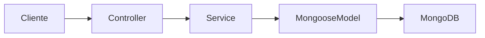
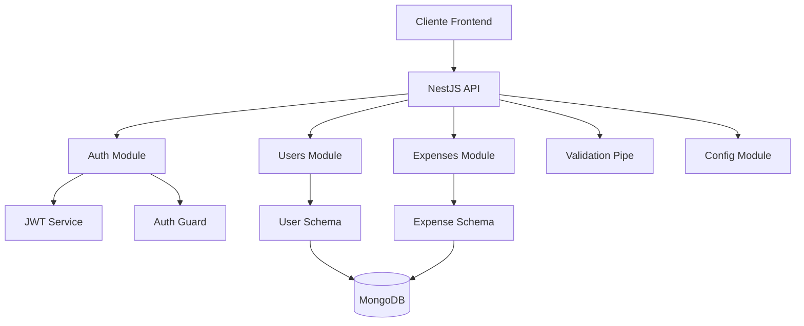
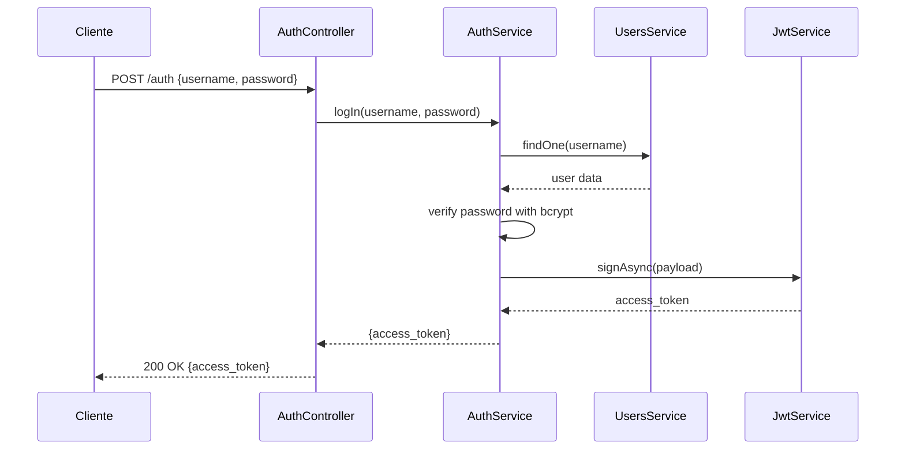
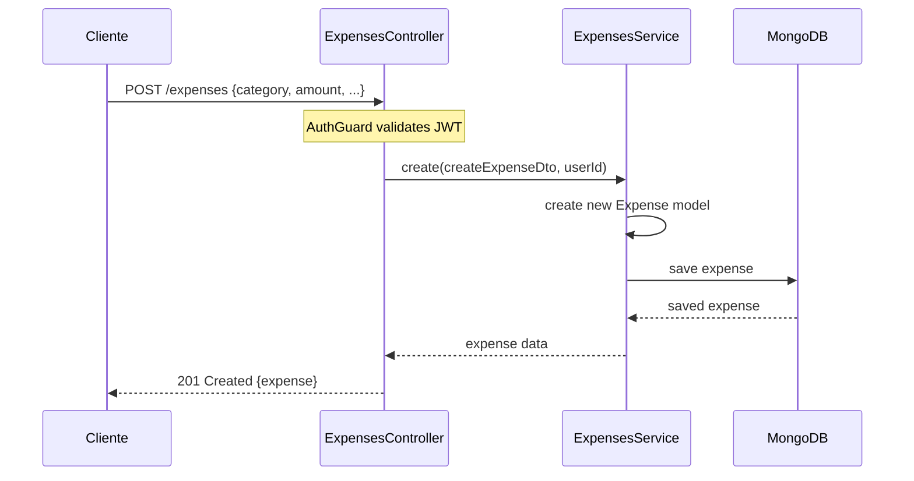
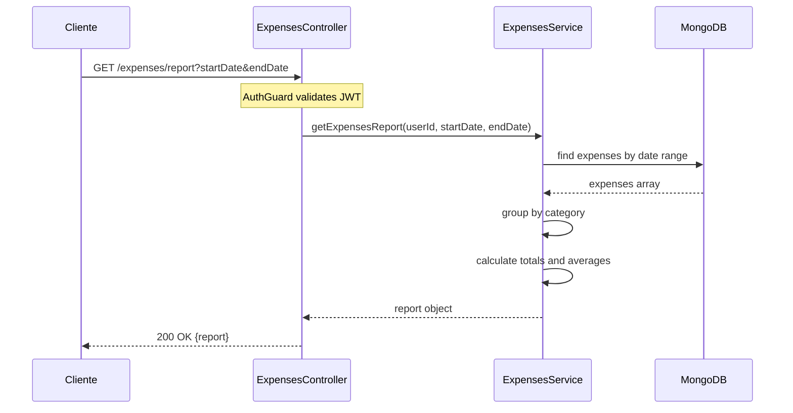

# Gestor Gastos API


Este proyecto es una API REST moderna para la gestión de gastos personales, construida con NestJS y MongoDB.

La aplicación proporciona funcionalidades completas para:

- **Autenticación segura** con JWT
- **Registro y gestión de usuarios**
- **Creación, edición y eliminación de gastos**
- **Generación de reportes por categorías**
- **API RESTful** con validación automática de datos

## 🛠 Stack Tecnológico

### Tecnologías Principales

- **[NestJS 10](https://nestjs.com/)** - Framework Node.js progresivo para aplicaciones del lado del servidor
- **[MongoDB](https://www.mongodb.com/)** - Base de datos NoSQL para almacenamiento flexible
- **[Mongoose](https://mongoosejs.com/)** - ODM para MongoDB y Node.js
- **[TypeScript](https://www.typescriptlang.org/)** - Superset de JavaScript con tipado estático
- **[JWT](https://jwt.io/)** - JSON Web Tokens para autenticación stateless

### Librerías de Soporte

- **bcrypt** - Hashing seguro de contraseñas
- **class-validator** - Validación automática de DTOs
- **class-transformer** - Transformación de objetos
- **@nestjs/jwt** - Integración JWT con NestJS
- **@nestjs/mongoose** - Integración MongoDB con NestJS

### ¿Por qué este stack?

- **NestJS**: Este framework provee una estructura clara y facilidades para crear aplicaciones robustas, fue elegido por su gran capacidad de escalabilidad también para poner en practica el desarrollo de una arquitectura modular limpia y un código escalable.
- **MongoDB**: Flexibilidad de esquemas, escalabilidad horizontal, ideal para datos semi-estructurados
- **TypeScript**: Detección temprana de errores, mejor experiencia de desarrollo, mantenibilidad
- **JWT**: Autenticación stateless, escalabilidad, compatibilidad con microservicios

## 🏗 Arquitectura

### Arquitectura Modular

La aplicación sigue la arquitectura modular de NestJS, creé un monolito modular con responsabilidades claras definidas en cada modulo, internamente cada modulo sigue una estructura con DTO's, schemas si es el caso y su respectivo controlador y servicio.

```
src/
├── modules/
│   ├── auth/          # Autenticación y autorización
│   ├── users/         # Gestión de usuarios
│   └── expenses/      # Gestión de gastos
├── lib/               # Utilidades compartidas
└── main.ts            # Punto de entrada
```

### Flujo Básico de un Request

El flujo típico de una petición sigue la secuencia:



- **Cliente**: Realiza una petición HTTP a la API.
- **Controller**: Recibe y verifica los datos de entrada.
- **Service**: Contiene la lógica de negocio y manipula la información.
- **Mongoose Model**: Modela y comunica los datos con la base de datos.
- **MongoDB**: Almacena o recupera la información.

### Schemas de Mongoose

A continuación se presentan los esquemas principales utilizados en el sistema. Estos definen la estructura de los documentos en MongoDB para usuarios y gastos.

#### UserSchema `users/schemas/user.schema.ts`

```typescript
import { Prop, Schema, SchemaFactory } from '@nestjs/mongoose';

@Schema()
export class User {
  @Prop()
  username: string;

  @Prop({ required: false })
  age: number;

  @Prop()
  email: string;

  @Prop()
  password: string;
}

export const UserSchema = SchemaFactory.createForClass(User);
```

#### ExpenseSchema `expenses/schemas/expense.schema.ts`
Entiendase un objeto `Expense` como un gasto único de un usuario que en conjunto se puede usar para obtener informacion sobre sus gastos en general.

```typescript
import { Prop, Schema, SchemaFactory } from '@nestjs/mongoose';
import mongoose from 'mongoose';
import { User } from '../../users/schema/user.schema';

@Schema()
export class Expense {
  @Prop({ type: mongoose.Schema.Types.ObjectId, ref: 'User' })
  user: User;

  @Prop()
  category: string;

  @Prop({ required: false })
  description: string;

  @Prop()
  amount: number;

  @Prop({ default: new Date() })
  date: Date;
}

export const ExpenseSchema = SchemaFactory.createForClass(Expense);
```

## Diagrama de Arquitectura



### Características Arquitectónicas

- **Modularidad**: Cada funcionalidad está encapsulada en su propio módulo
- **Guards Globales**: Protección automática de rutas con excepciones públicas
- **Validación Automática**: Validación de entrada con class-validator
- **Configuración Centralizada**: Variables de entorno gestionadas por ConfigModule

## 🎨 Patrones de Diseño Implementados

### 1. Dependency Injection (DI)

**¿Por qué?** Permite desacoplar componentes y facilita testing y mantenimiento.

```typescript
@Injectable()
export class AuthService {
  constructor(
    private readonly usersService: UsersService,
    private readonly jwtService: JwtService,
  ) {}
}
```

### 2. Guards Pattern

**¿Por qué?** Centraliza la lógica de autorización y permite rutas públicas con decoradores.

```typescript
@Public()
@Post()
signIn(@Body() loginDto: LoginDto) {
  // Ruta pública, no requiere autenticación
}
```

### 3. Data Transfer Objects (DTOs)

**¿Por qué?** Validación automática, documentación de API, y transformación de datos.

```typescript
export class CreateExpenseDto {
  @IsNotEmpty()
  category: string;

  @IsNumber()
  amount: number;
}
```

### 4. Decorator Pattern

**¿Por qué?** Metadatos declarativos para configuración y comportamiento.

```typescript
@Controller('expenses')
@UseGuards(AuthGuard)
export class ExpensesController {}
```

## 🔗 Endpoints de la API

### Autenticación

| Método | Endpoint | Descripción    | Autenticación |
| ------ | -------- | -------------- | ------------- |
| `POST` | `/auth`  | Iniciar sesión | ❌ Público    |

**Ejemplo de Request:**

```json
{
  "username": "usuario123",
  "password": "password123"
}
```

**Ejemplo de Response:**

```json
{
  "access_token": "eyJhbGciOiJIUzI1NiIsInR5cCI6IkpXVCJ9..."
}
```

### Usuarios

| Método | Endpoint            | Descripción                 | Autenticación |
| ------ | ------------------- | --------------------------- | ------------- |
| `POST` | `/users`            | Registrar nuevo usuario     | ❌ Público    |
| `GET`  | `/users/loggedUser` | Obtener usuario autenticado | ✅ Requerida  |

**Ejemplo de Registro:**

```json
{
  "username": "usuario123",
  "email": "usuario@ejemplo.com",
  "password": "password123",
  "age": 25
}
```

### Gastos

| Método   | Endpoint           | Descripción                    | Autenticación |
| -------- | ------------------ | ------------------------------ | ------------- |
| `POST`   | `/expenses`        | Crear nuevo gasto              | ✅ Requerida  |
| `GET`    | `/expenses`        | Listar gastos del usuario      | ✅ Requerida  |
| `GET`    | `/expenses/report` | Generar reporte por categorías | ✅ Requerida  |
| `PUT`    | `/expenses/:id`    | Actualizar gasto               | ✅ Requerida  |
| `DELETE` | `/expenses/:id`    | Eliminar gasto                 | ✅ Requerida  |

**Ejemplo de Crear Gasto:**

```json
{
  "category": "Alimentación",
  "description": "Cena en restaurante",
  "amount": 45.5,
  "date": "2024-01-15"
}
```

**Ejemplo de Reporte:**

```
GET /expenses/report?startDate=2024-01-01&endDate=2024-01-31
```

**Response del Reporte:**

```json
{
  "Alimentación": {
    "totalAmount": 250.75,
    "totalExpenses": 8,
    "avgExpense": 31.34
  },
  "Transporte": {
    "totalAmount": 120.0,
    "totalExpenses": 12,
    "avgExpense": 10.0
  }
}
```

## 📊 Diagramas de Secuencia

### Flujo de Autenticación



### Flujo de Creación de Gasto



### Flujo de Generación de Reporte



## 🚀 Instalación y Configuración

### Prerrequisitos

- Node.js (v18 o superior)
- pnpm (recomendado) o npm
- MongoDB (local o MongoDB Atlas)

### Instalación

1. **Clonar el repositorio:**

```bash
git clone <repository-url>
cd gestor-gastos-api
```

2. **Instalar dependencias:**

```bash
pnpm install
```

Crear el archivo `.env` con tus valores:

```env
MONGO_URI=mongodb://localhost:27017/gestor-gastos
JWT_SECRET=tu-secreto-jwt-super-seguro
PORT=3000
```

4. **Ejecutar la aplicación:**

```bash
# Desarrollo
pnpm run start:dev

# Producción
pnpm run build
pnpm run start:prod
```

### Variables de Entorno

| Variable     | Descripción                    | Ejemplo                                   |
| ------------ | ------------------------------ | ----------------------------------------- |
| `MONGO_URI`  | URL de conexión a MongoDB      | `mongodb://localhost:27017/gestor-gastos` |
| `JWT_SECRET` | Secreto para firmar tokens JWT | `mi-secreto-super-seguro-123`             |
| `PORT`       | Puerto del servidor            | `3000`                                    |

## 📜 Scripts Disponibles

```bash
# Desarrollo
pnpm run start:dev     # Ejecutar en modo desarrollo con hot-reload
pnpm run start:debug   # Ejecutar en modo debug

# Construcción
pnpm run build         # Compilar TypeScript a JavaScript

# Producción
pnpm run start         # Ejecutar aplicación compilada
pnpm run start:prod    # Ejecutar en modo producción

# Testing
pnpm run test          # Ejecutar tests unitarios
pnpm run test:watch    # Ejecutar tests en modo watch
pnpm run test:cov      # Ejecutar tests con coverage
pnpm run test:e2e      # Ejecutar tests end-to-end

# Calidad de código
pnpm run lint          # Ejecutar ESLint
pnpm run format        # Formatear código con Prettier
```

## 🧪 Testing

### Configuración de Tests

La aplicación incluye una configuración completa de testing con:

- **Jest** como framework de testing
- **MongoDB Memory Server** para tests de integración
- **Supertest** para tests E2E
- **Coverage threshold** del 80%

### Ejecutar Tests

```bash
# Tests unitarios
pnpm run test

# Tests con coverage
pnpm run test:cov

# Tests end-to-end
pnpm run test:e2e

# Tests en modo watch
pnpm run test:watch
```

### Estructura de Tests

```
src/
├──modules                    # Tests Unitarios por módulo
│   ├──auth
│   │   ├──auth.controlller.spec.ts
│   │   └──auth.service.spec.ts
│   ├──expenses
│   │   ├──expenses.controlller.spec.ts
│   │   └──expenses.service.spec.ts
│   └──users
│       ├──users.controlller.spec.ts
│       └──users.service.spec.ts
test/
├── app.e2e-spec.ts           # Tests E2E de la aplicación
├── auth.e2e-spec.ts          # Tests E2E de autenticación
├── expenses.e2e-spec.ts      # Tests E2E de gastos
├── integration/              # Tests de integración
│   ├── expenses.int-spec.ts
│   └── users-auth.int-spec.ts
└── utils/                   # Utilidades para testing
    ├── auth.helper.ts
    ├── e2e-app.factory.ts
    └── mongo-memory.server.ts
```

## 📘 Aprendizajes

Durante el desarrollo del proyecto enfrenté varios desafíos, especialmente en el **testing**, donde tuve que aprender a configurar **Jest** y **MongoDB Memory Server**, ya que al inicio las pruebas fallaban por errores de entorno y dependencias, aprender a Mockear para hacer los tests de integración fue un proceso complejo para mí.

También tuve dificultades al trabajar con **Mongoose**, sobre todo al definir esquemas y manejar referencias entre modelos, pero esto me ayudó a entender mejor cómo funciona un ODM y cómo mantener una estructura de datos clara y tipada.  

Estos retos fortalecieron mis habilidades en backend y me ayudaron a comprender más a fondo el ecosistema de **Nest**, afortunadamente logré entender y desarrollar el proyecto como me lo imaginaba!

### 🔗 Referencias
- [Documentación oficial de NestJS](https://docs.nestjs.com/)
- [Documentación oficial de Mongoose](https://mongoosejs.com/docs/)

#### Desarrollado por
Deiber Verano: deiberveranodev@gmail.com